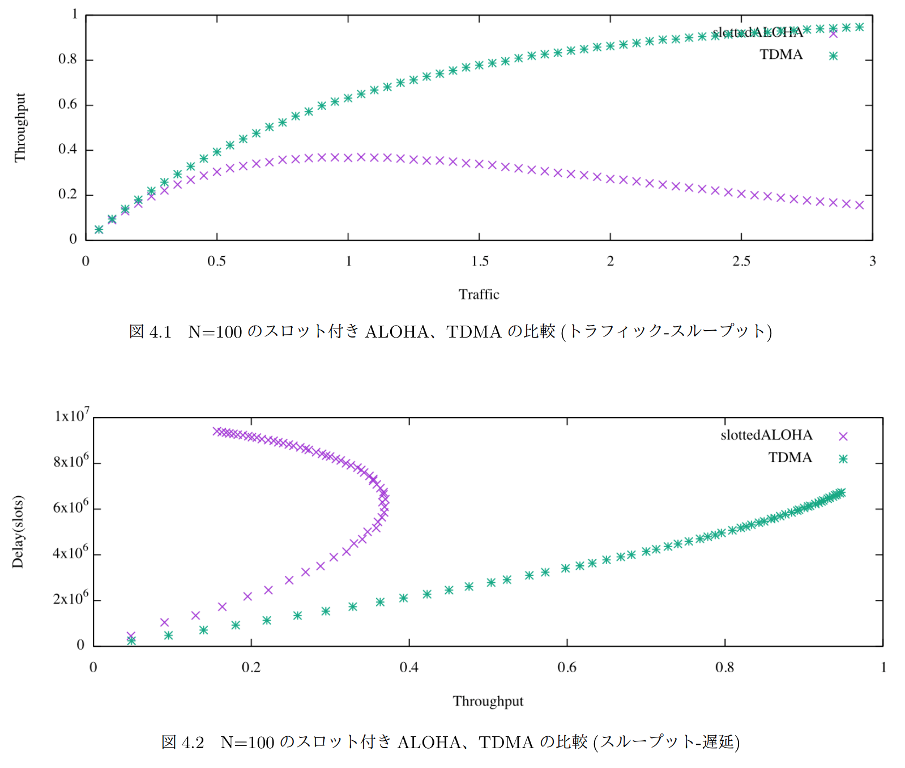

# ALOHA simulator
This is a TDMA simulator.  

Given the number of stations and delay time, it outputs delay characteristics and throughput characteristics as space-separated CSV (SSV).

It was created for comparison with ALOHA protocol.



## Usage
```
$ g++ TDMA.cpp
$ ./a.out > out.csv
```

## comment
TDMAとやらのシミュレータ。ローカルリポジトリがどっかいったので履歴なし。slotted ALOHAバージョンとの比較のために作成。ずいぶん前に作ったので、READMEの説明がおかしいかもしれないので不安な場合コードをご覧ください。
